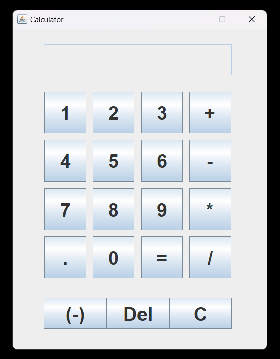

# Java Swing Calculator

A simple, clean, and functional desktop calculator application built using Java's Swing GUI toolkit. This project serves as an excellent introduction to GUI programming in Java.




### 📋 Description
---
This is a basic calculator that performs standard arithmetic operations. The user interface is designed to be intuitive and familiar, mimicking the layout of a classic electronic calculator. It's built entirely with standard Java libraries, requiring no external dependencies.


### ✨ Features
---
Basic Arithmetic: Addition, Subtraction, Multiplication, and Division.

Decimal Support: Full support for floating-point numbers.

Clear Functions:

C (Clear): Resets the entire calculation.

Del (Delete): Removes the last digit entered.

Negative Numbers: A (-) button to toggle the sign of the current number.

Error Handling: Prevents crashing on invalid operations like division by zero.

Responsive UI: Buttons provide visual feedback on click.


### 🛠️ Technologies Used
---
Language: Java

GUI Toolkit: Java Swing

IDE: Any standard Java IDE (e.g., VS Code, IntelliJ IDEA, Eclipse)


### 🚀 How to Run
---
To run this project, you need to have a Java Development Kit (JDK) installed on your machine.

1. Clone the repository:
```
git clone https://github.com/chefcookscode/JavaCalculator.git

```
```
cd JavaCalculator

```

2. Compile the Java code:
Open your terminal or command prompt, navigate to the source directory, and run the Java compiler.
```
javac Calculator.java

```

This will create a Calculator.class file.

3. Run the application:
Execute the compiled class file.
```
java Calculator

```
The calculator window should now appear on your screen.


### 📂 Code Structure
---
The entire application is contained within a single file, Calculator.java.

Calculator() (Constructor):

Initializes the JFrame (the main window).

Sets up the JTextField which acts as the display.

Creates all JButton instances for numbers and functions.

Uses a JPanel with a GridLayout to arrange the main buttons.

Adds an ActionListener to every button to listen for clicks.

actionPerformed(ActionEvent e):

This is the core logic method that is triggered on any button click.

It uses e.getSource() to identify which button was pressed.

It updates the display for number clicks, stores the first number and operator for arithmetic clicks, and performs the final calculation when the equals button is pressed.

### 📈 Potential Improvements
---
This is a foundational version of the calculator. Future enhancements could include:

Keyboard Support: Allow users to input numbers and operators using their keyboard.

Improved Chained Operations: Refactor the logic to correctly handle sequences like 5 * 2 + 3 without needing to press equals in between.

Advanced Operations: Add scientific functions like square root, percentage, and exponents.

History Feature: A panel to display a log of recent calculations.

Theming: Allow users to switch between different color themes (e.g., light and dark mode).
